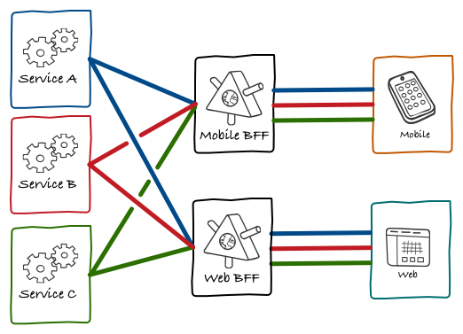

> _Should we adopt GraphQL?_

Here's a question [we](https://www.managedbyq.com/) confronted in earnest a few months ago. What follows is what I would’ve wanted to read then, written for anyone in the business of building software. 

tl;dr: We should. While it seems trendy, we found GraphQL solved a concrete set of problems and, in the process, afforded our team a faster, more reliable way to operate.

## Background

For 5 years, we’ve grappled with problems for a specific set of customers. As is common for an early-product org, we’ve tried to deepen our understanding of their problems and, through iteration, discover what exactly would make their work-lives better. This process brought with it a common subset of change—changes to featureset, domain modeling, and in our case business model, too. 

As anyone who’s written software for a living knows, what defines good design is whether your software can adapt to change over time and, for the most part, our architecture has flexed well. Roughly:

We have 3 active web clients: 1 for customers, 1 for partners, and 1 for internal teams. Each speaks to a constellation of data services through corresponding orchestration apps—applications that orchestrate requests across that constellation by way of fairly standard REST endpoints. Many, ourselves included, call this [the BFF pattern](https://philcalcado.com/2015/09/18/the_back_end_for_front_end_pattern_bff.html).

Credit [Phil](https://philcalcado.com/) for the vis not to mention pattern.

But after 5 years of discovery, we’ve landed on a set of features our customers use and we’re experiencing a different kind of change. One in particular stands out: our customers want a mobile app—they want the features they already have, but on the computer they carry with them. And while this may not seem meaningful architecturally (it’s just more software), I’ve learned it is. Mobile isn’t just more software, it represents a brand new set of constraints to build against.

#### Today
1. We serve customers at their desks, over their wifi.
1. We release changes over the internet, 20+ times per day.
1. We have 3 sets of users, so 3 corresponding clients.

#### Tomorrow
1. We serve customers everywhere, over unreliable networks.
1. We release changes at the mercy of Apple, once per week.
1. We have 3 sets of users, so possibly (3 * num platforms) clients.

## Latent problems

1. We network suboptimally
1. We maintain fragile contracts
1. We write redundant orchestration logic

### _We network suboptimally_

Specifically, our orchestration pattern permits too many requests for too much data.

For example, instead of writing custom endpoints within our clients, we sometimes reuse ones that already exist, even if it means multiple roundtrip requests to our orchestration apps to render a single page. Likewise, we almost always bluntly pass data from our orchestration apps to their client, without whitelisting down to the fields we actually need. 

We arrived here because it was faster to deliver features this way and customers don’t mind—with wifi and a glut of RAM, they themselves made up for any deficiencies in speed and space. 

But things are changing. We’ll soon serve customers everywhere—at times on the subway—on tiny, data-and-networking-constrained devices. Soon, suboptimal networking will matter.

### _We maintain fragile contracts_

As a developer requesting data today, I look at implementations upstream to grok a given payload. Likewise, as a developer exposing data, I look downstream to see which clients sit dependent. Said another way, there exist contracts between our data services and dependent clients—contracts implied by implementations on either side. 

Contracts of this type are common, and we’ve developed systems to monitor them, and processes (albeit manual) to dissuade people from accidentally breaking them. But accidents happen.

This isn’t a big deal right now—we can ship a fix to a broken client contract within minutes on the web. But things, again, are different. We’ll soon be at the mercy of Apple to ship a fix, which could make fixing something a multi-day process.

### _We write redundant orchestration logic_

Today, all of our clients contain a list of orders, which means our orchestration apps all include logic to fetch a list of orders. We don’t mind the redundancy. We’ve decided repeating ourselves outweighs risking the wrong abstraction. Afterall, having only been committed to the web, we’ve capped redundancies to 3 to match our audiences (customers, partners, and internal teams). 

Mobile represents at least one additional client and plausibly more, as we’re not just adding an audience (e.g. partners), we’re adding at least one platform for our audiences (e.g. iOS). To keep pace on new feature development, it’s time to reconsider these redundancies. 

## A better bridge

The architecture in question is a specific slice: it’s neither within our data services nor within our clients—it’s the layer that bridges our data services to our clients. Let’s run with this bridge analogy a second.

Let’s say each orchestration app and corresponding endpoints represents a bridge. As we’ve seen, the prospect of a mobile client exposes our bridges: with suboptimal networking, fragile contracts, and redundant orchestration, it’s rendered each bridge inefficient, precariously opaque, and single purpose, built for just one audience. 

To continue delivering high-quality software with pace, we have to reconsider our set of bridges in light of these problems. Unsurprisingly, we aren’t the only team to confront them and, after speaking with friends throughout the industry, one solution stood out: GraphQL.

GraphQL was designed in response to [the same set of problems](https://www.youtube.com/watch?v=WQLzZf34FJ8&feature=youtu.be&t=213) confronted on the move from web to mobile. You can think of it and its surrounding ecosystem as a single, uniform bridge between your constellation of data services and the clients your customers rely on. As advertised:

1. Instead of **suboptimal networking**, we make one request and get back only the data we ask for. Our bridge can now accommodate full payloads of interrelated data with no extra cost, and will only deliver what you asked for.
1. Instead of **fragile contracts**, we maintain one typed schema with an accompanying query language. Our bridge is now explicit and visible. It tells us what it expects, what we should expect in response, and stop us if we use it the wrong way.
1. Instead of **redundant logic**, we write (reusable) relationships between our data types. We no longer need to build a bunch of one-lane bridges ad hoc, we instead focus on one bridge with a few on ramps, that’s accommodating to audiences payloads we couldn’t predict.

With these in mind, we structured a project to prove or disprove that GraphQL has a long-term place within our stack. In doing so, we learned that while GraphQL the spec and its intended benefits are great and all, what’s more striking is this smattering of other benefits we’re still uncovering. It has:

- Sped up client development by [making our data-fetching feel declarative](https://github.com/apollographql/react-apollo#usage).
-Decoupled client / data-fetching development through straightforward mocking—[a single line of code now mocks our entire GraphQL server](https://www.apollographql.com/docs/apollo-server/api/graphql-tools/#addmockfunctiontoschemaoptions).
- Simplified integration testing—we can render the whole app using this same mock server.
- Eased developer on-boarding, with [self-documentation](https://graphql.org/learn/introspection/) and [exploratory tooling](https://github.com/graphql/graphiql/tree/ide-monorepo) for our data.
- Given us [push-button monitoring](https://docs.datadoghq.com/integrations/apollo_engine/) for all network activity.
- Supported coupling we do want through [code-generated typescript types](https://github.com/apollographql/apollo-tooling#apollo-clientcodegen-output).
- Facilitated [safe changes to our api](https://www.apollographql.com/docs/platform/schema-validation/) through schema validation.
- Provided reference implementations in [just](https://graphene-python.org/) [about](https://github.com/graphql/graphql-js) [any](https://graphql-ruby.org/) [programming](https://github.com/webonyx/graphql-php) [language](https://github.com/graphql-java/graphql-java) [we’d](https://github.com/graphql-dotnet/graphql-dotnet) [want](https://github.com/haskell-graphql/graphql-api).

We learned that while GraphQL probably did created a better bridge, its more impressive achievement is the attention it afforded this layer of our stack. GraphQL has created a new ecosystem of bridge builders—us now included. 

## That being said

It hasn’t been all sunshine. GraphQL’s ecosystem is still nascent, which means we’ve confronted problems with no right answer, and found ourselves surprised by things we only thought we fully understood. Here are some examples:

- The n+1 problem—should we cache or should we batch network requests? And how?
- How should we handle permissions alongside GraphQL, especially if all of our clients are hitting the same orchestration server?
- For our first couple months in production, any user could DOS our graphQL server with a simple query.
- For our first couple months of local development, we didn’t properly format errors coming from downstream services, making it hard to debug simple downstream errors.
- Apollo makes client-side caching very easy, and we got burnt mishandling related errors. How does caching actually work? What should our policy be around caching?
- We only just arrived at a client-side querying pattern we all agree on, and have yet to do the same for mutations (with related local cache updates, etc.).

Most notably, GraphQL is just different. It’s a new paradigm, and requires not just that you earn the associated mental models, but that your team does, too. And your team definitely has other shit going on. This cultural challenge has been [called out by many](https://graphqlpatterns.simplecast.com/episodes/graphql-at-airbnb-b414a6fc?t=34m52s) as GraphQL’s biggest—overcoming requires compromise, tolerance of mistakes that come with change, and deliberate steps. We’re still not all the way there. 

In a follow up essay, we’ll describe our implementation of GraphQL in more technical terms including how we addressed many of the problems outlined above. Stay tuned by signing up below.

Btw if you’re interested in building bridges alongside us, [we’re hiring](https://www.managedbyq.com/careers).

-

_Thanks to [Matt Briançon](https://mattbriancon.com/index.html), [Phil Sarin](https://twitter.com/philsarin), and Jeffrey Silver for reading drafts of this post._

-s
